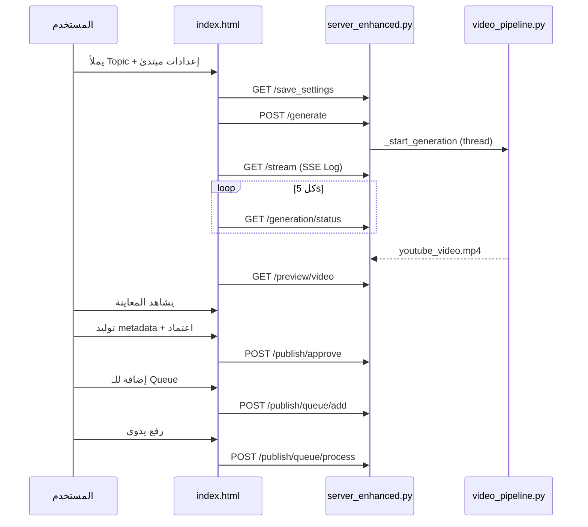

# مواصفات المنتج — مولد فيديوهات مدرسة الذكاء الاصطناعي

**الإصدار:** 1.0  
**التاريخ:** 2026-06-29  
**Pipeline:** v2.4.0  
**الجمهور:** Cursor + المطوّر (عبدالله فتحي السوالمة)  
**الحالة:** معتمد — جاهز للتنفيذ

---

## 1. قرارات المنتج (معتمدة)

| # | السؤال | القرار |
|---|--------|--------|
| 1 | نوع الفيديوهات | **قصص إسلامية فقط** في هذه المرحلة (`content_profile = islamic_story`) — إخفاء `educational` و `general` من الواجهة مؤقتًا |
| 2 | شكل الـ Flow | **صفحة واحدة** (`templates/index.html`) مقسّمة إلى أقسام (توليد → Log → معاينة → نشر) — **ليس** Wizard متعدد الصفحات |
| 3 | مستوى التحكم | **وضع مبتدئ + وضع متقدم** (Toggle أو `<details>`) |
| 4 | النشر إلى YouTube | **يدوي:** اعتماد → Queue → زر رفع — **بدون** رفع تلقائي فور الاعتماد |
| 5 | حجم الإنتاج | **3–5 فيديوهات/يوم** — Queue الحالية كافية، لا حاجة لـ Job system معقد الآن |

### نطاق المستخدم

- **مستخدم واحد** (صاحب القناة) — تطبيق محلي على `127.0.0.1:8000`
- **لا SaaS** في هذه المرحلة
- **Feature freeze:** لا AI Video ولا ميزات جديدة حتى إثبات جودة الإنتاج (اختبار يوسف 60s أولاً)

---

## 2. تعريف «فيديو صحيح مطابق للمطلوب»

يُعتبر التوليد **ناجحًا** إذا تحقّقت **كل** الشروط:

| المعيار | الهدف | مصدر التحقق |
|---------|-------|-------------|
| المدة | ±5% من المطلوب (60s → 57–63s) | `outputs/production_report.json` → `video_duration_sec` |
| الصوت | عربي واضح بدون قطع | استماع + `tts_time_sec` مسجّل |
| الصور | متعلقة بالقصة (relevance ≥ 80) | `outputs/scene_quality_gate.json` |
| الوجوه | silhouettes فقط — لا وجوه واقعية للأنبياء | `face_visibility_score` + Quality Gate |
| النص في الصور | `text_artifacts` < 0.30 | Quality Gate |
| Quality Gate | ≥ 80% مشاهd passed | `passed / total` في gate JSON |
| سرعة الترميز | < 120s لفيديو 60s | `render_time_sec` (بعد `render_engine: ffmpeg`) |
| الملف النهائي | `outputs/youtube_video.mp4` موجود | `/preview/video` يعمل |
| لا أخطاء | `error: null` | `production_report.json` |

### Log نجاح متوقّع (SSE `/stream`)

```
🔧 Pipeline v2.4.0 | cache=OFF | quality_gate=ON | fresh_media=YES
🎨 ImageRouter Model: black-forest-labs/FLUX-1-schnell
🎞️ تجميع FFmpeg (1920x1080) — أسرع من MoviePy...
✅ اكتمل الترميز في ~30-60s (FFmpeg)
🛡️ Quality Gate: passed (4/5 أو 5/5)
🎉 اكتمل إنشاء الفيديو
```

---

## 3. هيكل الواجهة (صفحة واحدة)

```
┌─────────────────────────────────────────────────────────┐
│  Header: عنوان + روابط التواصل                          │
├─────────────────────────────────────────────────────────┤
│  [A] قائمة المواضيع (topics.txt)                        │
├─────────────────────────────────────────────────────────┤
│  [B] YouTube — ربط OAuth + إعدادات النشر                  │
├─────────────────────────────────────────────────────────┤
│  [C] نموذج التوليد                                      │
│      ├─ وضع مبتدئ (Topic, صوت, مدة, نوع فيديو)          │
│      └─ وضع متقدم (<details>) — cache, gate, model...   │
├─────────────────────────────────────────────────────────┤
│  [D] زر «توليد الفيديو»                                 │
├─────────────────────────────────────────────────────────┤
│  [E] Log مباشر (SSE)                                    │
├─────────────────────────────────────────────────────────┤
│  [F] معاينة (فيديو + thumbnail)                         │
├─────────────────────────────────────────────────────────┤
│  [G] بيانات النشر (عنوان، وصف، وسوم)                    │
├─────────────────────────────────────────────────────────┤
│  [H] Queue + سجل النشر                                  │
└─────────────────────────────────────────────────────────┘
```

### وضع مبتدئ (Beginner) — ظاهر دائمًا

| الحقل | `name` / `id` | القيمة الافتراضية |
|-------|---------------|-------------------|
| الموضوع | `#topic` | مطلوب |
| الصوت | `#voice_name` | أدم |
| المدة | `#video_duration_sec` | 60 |
| نوع الفيديو | `#video_format` | normal (16:9) |
| مصدر السكربت | `#script_source` | **auto** (للقصص الإسلامية) |

> `content_profile` **ثابت مخفي** = `islamic_story` (لا يظهر للمستخدم في وضع المبتدئ).

### وضع متقدم (Advanced) — داخل `<details>` أو Toggle

| الحقل | `id` | افتراضي | ملاحظة |
|-------|------|---------|--------|
| Cache المشاهd | `#scene_cache_enabled` | false (اختبار) / true (إنتاج) | |
| وسائط جديدة 100% | `#force_fresh_media` | false | للاختبار: true |
| Quality Gate | *(يُضاف للواجهة)* | true | موجود في Backend |
| تضمين قرآن | `#include_quran` | true | |
| تضمين حديث | `#include_hadith` | false | |
| دقة تاريخية | `#historical_accuracy` | true | |
| Hook / Cliffhanger / Lesson | `#hook_scene` … | true | |
| نمط بصري | `#visual_style` | cinematic_islamic | |
| نمط الراوي | `#narrator_style` | وثائقي | |
| سرعة TTS | `#tts_speed` | 0.95 | |
| مصدر الوسائط | `#media_source` | images | |
| ImageRouter model | *(يُضاف للواجهة)* | FLUX-1-schnell | متقدم فقط |
| render_engine | *(Backend فقط)* | ffmpeg | لا يظهر في UI |
| مسح Cache | زر | — | `POST /cache/clear` |

### تغييرات UI مطلوبة (Cursor)

1. **إخفاء** `#content_profile` أو تقييده على `islamic_story` فقط (إزالة educational/general من `<select>`).
2. **إضافة Toggle** «مبتدئ / متقدم» — إخفاء `#islamic_options_box` المتقدم في وضع المبتدئ.
3. **تغيير افتراضي** `script_source` من `scenes` إلى `auto` في `DEFAULT_SETTINGS`.
4. **إضافة checkbox** `quality_gate_enabled` في الوضع المتقدم (Backend يدعمه — Form في `/generate`).
5. **عدم** إضافة رفع YouTube تلقائي عند الاعتماد.

---

## 4. خريطة الأزرار ↔ Endpoints

### 4.1 التوليد

| عنصر UI | `id` / الحدث | Method | Endpoint | Backend |
|---------|--------------|--------|----------|---------|
| نموذج التوليد | `#form` submit | POST | `/generate` | `server_enhanced.generate_video_post` |
| إنشاء من القائمة | `#run_from_list` | GET | `/generate_from_list` | `generate_from_list` |
| إنشاء + نشر | `#run_from_list_and_upload` | GET | `/generate_from_list` ثم metadata | نفس + `/publish/metadata/generate` |
| حفظ الإعدادات | قبل التوليد | GET | `/save_settings?...` | `save_settings_endpoint` |
| Log مباشر | `EventSource` | GET | `/stream` | SSE — `_log_messages` |
| حالة التوليد | polling | GET | `/generation/status` | `_generation_lock.locked()` |
| معلومات المدة | `#video_duration_sec` change | GET | `/duration/info?video_duration_sec=` | `video_duration.get_mode_info` |
| مسح Cache | *(زر متقدم)* | POST | `/cache/clear` | `scene_cache.clear_*` |

**Body لـ `POST /generate`:** `FormData` من `#form` — الحقول الأساسية:

```
topic, voice_name, media_source, video_duration_sec, video_format,
script_source, content_profile, scene_cache_enabled, force_fresh_media,
quality_gate_enabled, include_quran, include_hadith, historical_accuracy,
visual_style, narrator_style, tts_speed, arabic_font, hook_scene,
cliffhanger, lesson_summary, caption_enabled, music_enabled, ...
```

### 4.2 المشاهd والبحث

| عنصر UI | Method | Endpoint | Backend |
|---------|--------|----------|---------|
| `#auto_generate_scenes` | POST | `/scenes/auto_generate` | Gemini/local scenes |
| `#parse_script_btn` | POST | `/scenes/parse_script` | `scene_script.parse_*` |
| `#research_topic_btn` | POST | `/research/topic` | `topic_research.*` |
| رفع صورة مشهد | POST | `/upload/scene` | حفظ في `outputs/scenes/uploads/` |
| Quality Gate | GET | `/scenes/quality-gate` | `outputs/scene_quality_gate.json` |
| `#refresh_quality_gate_btn` | GET | `/scenes/quality-gate` | — |
| تقرير الإنتاج | GET | `/production/report` | `outputs/production_report.json` |

### 4.3 المعاينة والتحميل

| عنصر UI | Method | Endpoint |
|---------|--------|----------|
| `#preview_video` src | GET | `/preview/video` |
| `#preview_thumbnail` src | GET | `/preview/thumbnail` |
| `#download_btn` | GET | `/download/video` |
| `#preview_status` | GET | `/video/status` |

### 4.4 النشر — YouTube (يدوي)

| خطوة | عنصر UI | Method | Endpoint |
|------|---------|--------|----------|
| 1. ربط الحساب | `#youtube_connect_btn` | GET | `/youtube/auth/start` |
| 2. OAuth callback | — | GET | `/youtube/auth/callback` |
| 3. حالة الربط | `#yt_status` | GET | `/youtube/status` |
| 4. فصل الحساب | `#youtube_disconnect_btn` | POST | `/youtube/disconnect` |
| 5. قوائم التشغيل | `#refresh_playlists_btn` | POST | `/youtube/playlists/refresh` |
| 6. قالب القناة | `#save_channel_template` | POST | `/channel/template` |
| 7. توليد metadata | `#generate_metadata_btn` | POST | `/publish/metadata/generate` |
| 8. حفظ metadata | `#save_metadata_btn` | POST | `/publish/metadata` |
| 9. توليد thumbnail | `#regenerate_thumbnail_btn` | POST | `/thumbnail/generate` |
| 10. رفع thumbnail | `#upload_thumbnail_input` | POST | `/thumbnail/upload` |
| 11. **اعتماد** | `#approve_publish_btn` | POST | `/publish/approve` |
| 12. **إضافة للـ Queue** | `#add_to_queue_btn` | POST | `/publish/queue/add` |
| 13. **رفع يدوي** | `#process_queue_btn` | POST | `/publish/queue/process` |
| 14. رفع عنصر واحد | زر في الجدول | POST | `/publish/queue/{item_id}/upload` |
| 15. عرض Queue | `#queue_table_body` | GET | `/publish/queue` |

**Flow النشر المعتمد:**

```
توليد → معاينة → توليد metadata → اعتماد → إضافة Queue → رفع يدوي
```

> **ممنوع:** استدعاء `/publish/queue/{id}/upload` تلقائيًا بعد `/publish/approve`.

### 4.5 قائمة المواضيع

| عنصر UI | Method | Endpoint | ملف |
|---------|--------|----------|-----|
| `#topics_stats` | GET | `/topics_info` | `outputs/topics.txt` |
| `#run_from_list` | GET | `/generate_from_list` | يتحقق من Lock قبل حذف الموضوع |

---

## 5. Flow كامل (User Journey)



---

## 6. القيود الشرعية والبصرية (إسلامي)

| القيد | التطبيق | الملف |
|-------|---------|-------|
| لا وجوه واقعية للأنبياء/الصحابة | Silhouettes في prompts | `story_reference.py`, `media_router.py` |
| قواعد AI Prompts | `ISLAMIC_DEPICTION_RULES` | `media_router.py` |
| آيات قرآنية | `include_quran: true` — مشهد quran slide | `quran_verses.py` |
| حديث | اختياري — `include_hadith: false` افتراضي | |
| ملخص درس | `lesson_summary: true` — مشهد أخير | `story_engagement.py` |
| Quality Gate | relevance + text artifacts + faces | `scene_quality_gate.py` |

### القصص المدعومة الآن

| القصة | `story_db` | `_topic_key` |
|-------|------------|--------------|
| يوسف | `data/stories/yusuf.json` ✅ | `story_reference.py` |
| أهل الكهف | local reference فقط | `story_reference.py` |
| أصحاب الفيل | local reference فقط | `story_reference.py` |
| أصحاب الأخدود | local reference فقط | `story_reference.py` |

> إضافة قصة جديدة: عبر `data/stories/{name}.json` + `story_db.py` — **ليس** من الواجهة في هذه المرحلة.

---

## 7. الأداء والموثوقية

| الهدف | القيمة | آلية |
|-------|--------|------|
| فيديو 60s — إجمالي | < 3 دقائق | FFmpeg render (~30-60s) + media (~30s) + TTS (~8s) |
| فيديو 300s — إجمالي | < 8 دقائق | chaptered + FFmpeg |
| Timeout توليد | 3600s max | `GENERATION_TIMEOUT_SEC` |
| Retry صور | 2 محاولات | `visual_quality_retries` |
| Lock توليد | واحد في كل مرة | `_generation_lock` → HTTP 409 |
| Lock رفع | واحد في كل مرة | `_upload_lock` + log |
| كتابة JSON ذرّية | ✅ | `atomic_io.py` |
| Queue يومية | 3–5 فيديو | `publish_queue.py` — كافية |

---

## 8. سيناريوهات اختبار

### سيناريو A — يوسف 60 ثانية (Smoke Test)

```yaml
topic: "قصة سيدنا يوسف عليه السلام"
video_duration_sec: 60
video_format: normal
script_source: auto
content_profile: islamic_story
scene_cache_enabled: false
force_fresh_media: true
quality_gate_enabled: true
render_engine: ffmpeg
imagerouter_model: black-forest-labs/FLUX-1-schnell
```

**تشغيل:**

```bat
py -3.12 scripts/run_yusuf_60s_test.py --clear-cache --start
```

**نجاح:** `render_time_sec < 120`, Quality Gate ≥ 4/5 passed.

### سيناريو B — أهل الكهف 300 ثانية (لاحقًا)

```yaml
topic: "قصة أهل الكهف"
video_duration_sec: 300
content_profile: islamic_story
script_source: auto
```

**نجاح:** chaptered output + `production_report.chaptered: true`.

### سيناريو C — نشر يدوي YouTube

1. إكمال سيناريو A
2. `POST /publish/metadata/generate`
3. `POST /publish/approve`
4. `POST /publish/queue/add`
5. `POST /publish/queue/process`
6. **تحقق:** فيديو على YouTube + status = `uploaded` في Queue

---

## 9. ملفات Backend الرئيسية

| الملف | الدور |
|-------|-------|
| `server_enhanced.py` | FastAPI — UI + endpoints + locks + settings |
| `video_pipeline.py` | TTS + media + compose (FFmpeg/MoviePy) |
| `topic_research.py` | بحث Gemini/local |
| `story_db.py` | قصص JSON + visual_requirements |
| `story_reference.py` | مراجع محلية + `_topic_key` |
| `media_router.py` | توجيه ai_image / pexels |
| `scene_quality_gate.py` | Quality Gate pre-compose |
| `scene_relevance.py` | relevance scoring |
| `scene_cache.py` | cache fingerprint |
| `publish_queue.py` | Queue JSON + upload worker |
| `production_report.py` | metrics + retention prediction |
| `production_session.py` | session_id + pipeline version |
| `atomic_io.py` | كتابة JSON ذرّية |
| `templates/index.html` | الواجهة الوحيدة |

---

## 10. إعدادات افتراضية موصى بها (Production)

```json
{
  "content_profile": "islamic_story",
  "script_source": "auto",
  "video_duration_sec": 60,
  "video_format": "normal",
  "voice_name": "أدم",
  "scene_cache_enabled": true,
  "force_fresh_media": false,
  "quality_gate_enabled": true,
  "render_engine": "ffmpeg",
  "imagerouter_model": "black-forest-labs/FLUX-1-schnell",
  "scene_relevance_min_score": 80,
  "caption_enabled": false,
  "music_enabled": true,
  "upload_enabled": false
}
```

---

## 11. خارج النطاق (Phase لاحقة)

- AI Video (Sora/Kling/…)
- Wizard متعدد الصفحات
- SaaS / multi-user
- مراجعة يدوية per-scene قبل الترميز
- إضافة قصة من الواجهة
- `educational` / `general` profiles
- رفع YouTube تلقائي فور الاعتماد
- Hosting / deployment

---

## 12. checklist تنفيذ Cursor

- [x] إخفاء `educational` و `general` من `#content_profile`
- [x] Toggle مبتدئ/متقدم في `index.html`
- [x] افتراضي `script_source = auto` في `DEFAULT_SETTINGS`
- [x] checkbox `quality_gate_enabled` في الوضع المتقدم
- [x] التأكد أن `/publish/approve` **لا** يستدعي upload تلقائي
- [x] اختبار سيناريو A وتسجيل `production_report.json`
- [x] Log يظهر `FFmpeg` وليس `MoviePy` فقط

---

*تطوير وتنفيذ المهندس عبدالله فتحي السوالمة — مدرسة الذكاء الاصطناعي*
